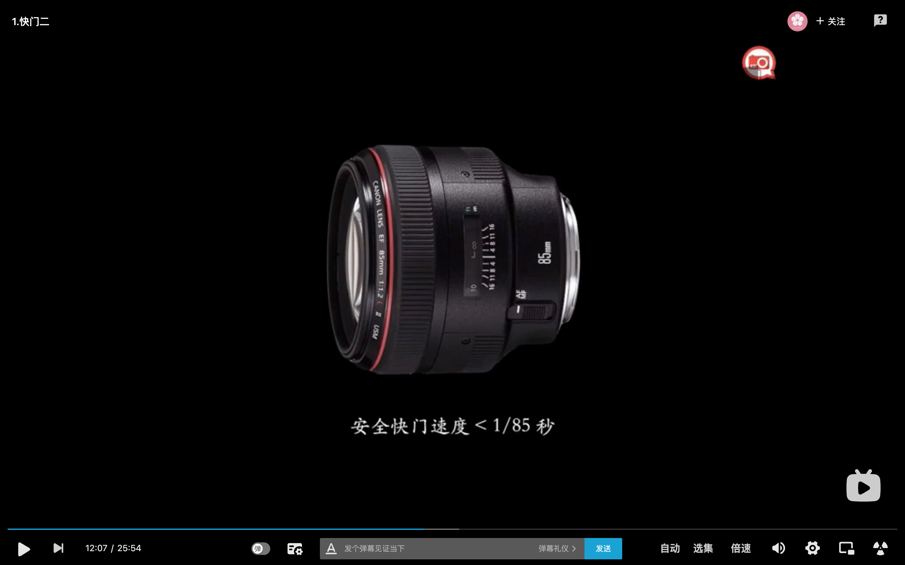

# 快门

## 快门的作用
控制光进来的时间长短，从而控制进来光的总量

## 快门的结构
前帘、后帘

#### 焦平面快门

#### 镜间快门

## 快门的工作过程

## 常见的国际标准快门值

#  快门的效果

## 高速快门的效果
1. 定格运动中的物体
2. 抵消相机的抖动

#### 安全快门

安全快门 < 1/等效焦距

## 中速快门的效果
1. 动静结合的画面

2. 追拍

## 低速快门的效果

记录运动的轨迹

[参考](https://www.bilibili.com/video/BV1ap4y1v7eC?p=17)