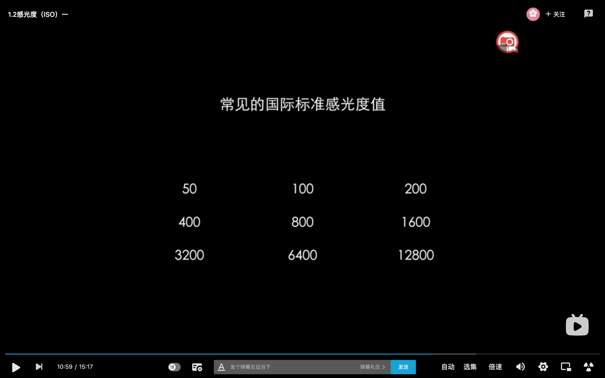
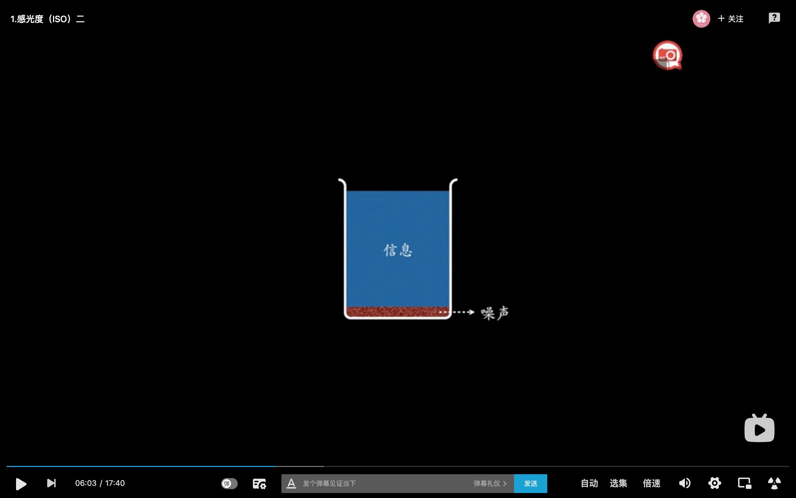
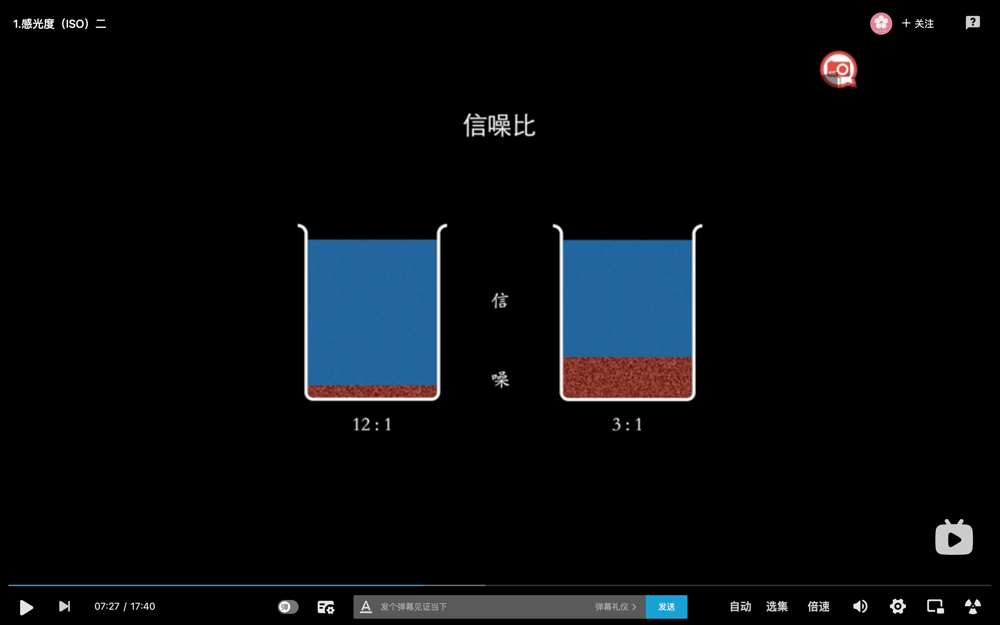

# ISO---感光度

## 含义
相机对光的敏感程度、敏感能力，对光放大、缩小的能力（相机内部把光转换成电信号，放大、缩小电信号）

## 国际标准感光度值

## 如何控制ISO
在相机上调节，因品牌而不同

## ISO的影响
#### 信噪比
信噪比：信息与噪声的比值

#### ISO越高
1. 噪点越明显
2. 对比度越高
3. 饱和度越低

好处：
1. 提高快门速度
2. 缩小光圈
3. 弱光时手持拍摄